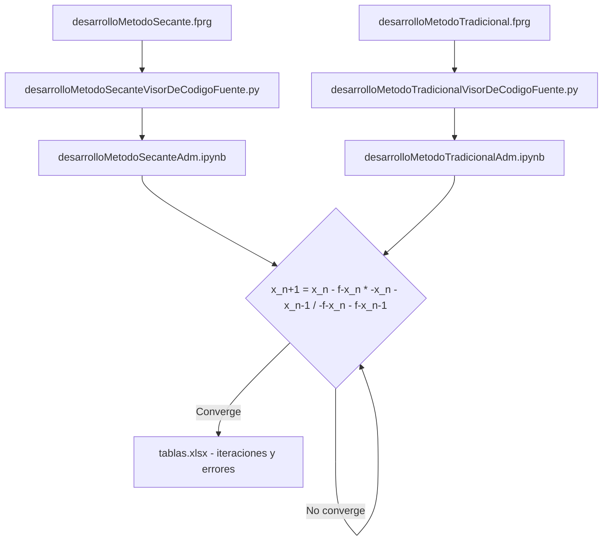

# Método de la Secante — Algoritmos, Diagramas de Flujo y Código Fuente

> Búsqueda de raíces con el método de la secante: diagrama de flujo en FlowPro, código fuente y análisis iterativo.

## Descripción

---

Implementación del **método de la secante** para búsqueda de raíces de funciones reales. A diferencia de Newton-Raphson, no requiere el cálculo explícito de la derivada — utiliza una aproximación por diferencias finitas entre dos puntos consecutivos. El proyecto incluye el diagrama de flujo estructurado en **FlowPro** y el código fuente con análisis de iteraciones.

## Contenido del repositorio

| Archivo | Descripción |
|---|---|
| `desarrolloMetodoSecante.fprg` | Diagrama de flujo en FlowPro/PseInt |
| `Secante.docx` | Implementación y análisis del método |
| `*.pdf` | Informe con iteraciones y convergencia |

## Método de la Secante

La aproximación entre dos puntos elimina la necesidad de calcular la derivada analíticamente:

**x_{n+1} = x_n - f(x_n) * (x_n - x_{n-1}) / (f(x_n) - f(x_{n-1}))**

Convergencia de orden superlineal (~1.618, la razón áurea).

## Contexto académico

**Asignatura:** Métodos Numéricos · **Institución:** Ingeniería Informática
**Autor:** Alejandro De Mendoza — Ingeniero Informático · Especialista Ingeniería de Software

---

## Arquitectura

## Arquitectura

## Autor

**Alejandro De Mendoza**  
Ingeniero Informático · Especialista en IA · Especialista en Ingeniería de Software · Máster en Arquitectura de Software

